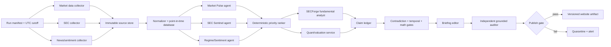
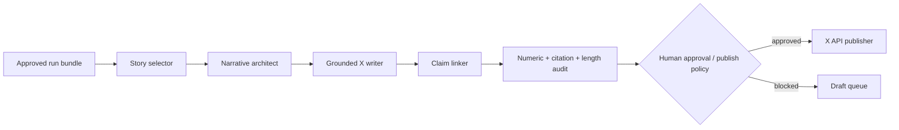

# MarketForge Production Workflow

## Core principle

LLMs may discover, rank, interpret, and write. They do **not** own numeric truth, timestamps, citations, calculations, simulation results, or publication approval. Those are deterministic program responsibilities.

“Zero hallucinations” is not a model capability. MarketForge instead uses a **fail-closed publication boundary**: a claim without an intact claim → evidence → immutable source chain cannot be published.

## Two independent automations

### Automation A — Daily intelligence

### Automation B — X article

Input is only the **approved, versioned daily run bundle** from Automation A. It must not browse or enrich.

## Production agents and contracts

| Stage | Agent/service | Reads | Writes | Cannot do |
|---|---|---|---|---|
| 0 | Run Controller | schedule, market calendar | run manifest, UTC cutoff | infer cutoff |
| 1 | SEC Collector | SEC submissions, XBRL, filing HTML/XML | hashed snapshots | summarize |
| 1 | Market Collector | licensed market API | point-in-time bars/quotes | estimate missing prices |
| 1 | News Collector | allowlisted providers | hashed articles/metadata | treat rumor as fact |
| 2 | Market Pulse | normalized market facts | ranked events + claim candidates | calculate returns itself |
| 2 | SEC Sentinel | filing diffs, forms | materiality queue | cite search snippets |
| 2 | Regime Agent | index/breadth/volatility facts | regime assessment | claim causal certainty |
| 3 | Priority Ranker | agent signals | deterministic score + selected names | free-form selection |
| 4 | SECForge | filing sections + verified facts | forensic claims, risk scores | create numbers or run fake simulations |
| 4 | Quant Engine | verified inputs + explicit assumptions | DCF/MC artifacts, hashes | let LLM calculate |
| 5 | Briefing Editor | approved claims only | article JSON | browse or add facts |
| 6 | Grounding Auditor | article + ledger + snapshots | pass/fail report | silently repair claims |
| 7 | Publisher | passed artifact | immutable web release | publish failed bundle |
| X | X Writer | approved claims only | X draft/thread JSON | external enrichment |

## Data source policy

1. **Tier 1 — primary:** SEC/EDGAR, company IR releases, exchange data, official macro releases.
2. **Tier 2 — professional secondary:** licensed price/fundamental/news providers.
3. **Tier 3 — narrative only:** reputable media and public social posts. Never the sole support for a numeric or filing claim.
4. Options flow and dark-pool claims are disabled unless a licensed, attributable dataset is configured. “Whale activity” must never be inferred from social chatter.

SEC ingestion must use a declared User-Agent and remain below the SEC’s current fair-access limit. Store the raw bytes, URL, retrieval time, accession, response metadata, and SHA-256 before parsing.

## Priority queue

Avoid asking an LLM to choose whatever “feels important.” Compute a reproducible score:

\[
S = 0.25M + 0.25F + 0.15V + 0.15N + 0.10I + 0.10R
\]

Where each feature is normalized to \([0,1]\):

- \(M\): absolute market move vs sector/index
- \(F\): filing materiality
- \(V\): unusual relative volume
- \(N\): novelty vs previous briefing
- \(I\): insider/ownership significance
- \(R\): relevance to current market regime

Store component scores and thresholds with the run. SECForge deep-dives only names above the configured threshold and daily count cap.

## Correct SECForge implementation

The supplied example outputs are useful format prototypes but not acceptable production evidence. They show failure modes that the pipeline must catch:

- filing and trade dates can be future-dated relative to a run;
- phrases such as “simulated EDGAR pipeline” can disguise absent extraction;
- page references are approximate (`p. ~40`) rather than anchored;
- peer metrics are marked “est.” yet presented as a comparison table;
- Monte Carlo outputs are asserted without code, seed, inputs, or result artifact;
- ratios use rough proxies (for example OCF as EBITDA), which invalidates leverage comparisons;
- market-cap/FCF statements can be dimensionally or economically implausible;
- “latest” filings are not proven from a point-in-time filing index.

Production SECForge therefore receives only:

1. the run cutoff;
2. accession-numbered filing snapshots;
3. extracted filing sections with stable locators;
4. verified XBRL facts with units, periods, forms, and filed dates;
5. point-in-time Form 4 transactions;
6. deterministic peer facts and valuation outputs.

Every finding is emitted as structured claims, never as an unconstrained report.

## Bayesian and Monte Carlo policy

“Bayesian updated” is allowed only when the update is mathematically specified and stored:

- prior family and hyperparameters;
- observed variable and measurement model;
- likelihood;
- posterior parameters or posterior samples;
- rationale tying each observation to evidence;
- code version/hash, random seed, iterations, and result hash.

If the analysis merely adjusts assumptions after reading a filing, label it **scenario calibration**, not Bayesian updating.

Monte Carlo must run in code. The LLM may explain results but cannot invent percentiles or probabilities. WACC must exceed terminal growth in every retained draw; units, share count, net debt, dilution, and valuation date must be explicit.

## Publication gates

All must pass:

1. **Schema:** exact JSON contract; no extra free-form fields.
2. **Cutoff:** all source retrieval, filing, price, and claim timestamps are \(\le\) run cutoff.
3. **Snapshot:** content hash matches immutable source snapshot.
4. **Evidence:** quotes exist verbatim; XBRL facts resolve to accession/context/unit.
5. **Numbers:** all numeric tokens in prose are present in linked evidence or deterministic outputs.
6. **Math:** ratios and growth rates recompute inside tolerance.
7. **Simulation:** code hash, result hash, seed, assumptions, and \(\ge 10{,}000\) iterations.
8. **Conflicts:** material disagreements are resolved or disclosed.
9. **Coverage:** every article paragraph and X post references known claims.
10. **Editorial:** banned language, missing disclaimer, stale data, duplicate story, and formatting checks.
11. **Approval:** initial launch requires human approval; autonomous publishing can be enabled only after measured reliability.

A failed gate produces no partial public artifact. It writes a quarantine report and alerts the operator.

## Website architecture

Recommended v1: static, versioned site generated from approved run bundles.

- Object storage/CDN for immutable `/reports/YYYY/MM/DD/<run-id>/` releases.
- `latest.json` pointer updates atomically only after validation.
- Each report displays cutoff time, data freshness, source links, claim/evidence drawer, methodology, correction history, and disclaimer.
- Corrections create a new revision; never overwrite the old bundle silently.
- A database can be added for watchlists/search later, but the report artifact remains immutable.

## Orchestration

Use a real workflow engine for production (Temporal, Dagster, or Prefect) because retries, idempotency, state, and artifact lineage matter. Hermes cron can trigger a self-contained run, but its short hard interrupt makes it a launcher/monitor rather than the home for long collection and analysis jobs.

Suggested schedule (ET and exchange-calendar aware):

- 05:30 premarket collection
- 06:00 SEC/news/market parallel scan
- 06:15 priority queue
- 06:20 deep dives and quant
- 06:45 briefing, audit, approval queue
- optional 16:20 close revision
- X automation starts only after the chosen website revision is approved

## Observability

Track per run: sources fetched, stale/missing feeds, request latency, claims generated/rejected, unsupported numeric-token count, conflicts, simulation reproducibility, gate status, article revision, publish ID, and correction rate. Alert on any primary-source outage or sudden source-count drop.
